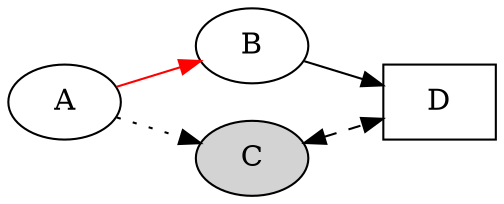

+++
Date = "2014-09-06T21:00:00.000Z"
Title = "Graphviz"
Description = "Graphviz on automatisoitu työkalu graafien piirtämiseen."
Week = "4x37"
Number = "193"
Alustat = ["Linux","Windows","Mac OS X","FreeBSD","OpenBSD","NetBSD","Solaris"]
Tagit = ["Kuvat","Kaaviot","Tiede"]
Type = "post"
Author = "Pesasa"
Pageimage = "valo193-graphviz.png"
+++


**Graphviz on automatisoitu työkalu graafien piirtämiseen.**

 Graphviz piirtään
huolellisesti sijoiteltuja graafeja sille annetusta tekstimuotoisesta
tiedosta. Piirrettävän graafin tiedot kirjoitetaan tekstitiedostoon,
joka kuvaa graafissa esiintyvät solmut ja niiden väliset kaaret.
Solmuille määritellään niiden sisältöteksti sekä ulkoasu, eli väri,
muoto, tyyppi sekä muita ominaisuuksia, ja kerrotaan, mitkä solmut on
yhdistetty toisiinsa kaarilla. Kaarille voidaan niin ikään määritellä
erilaisia ominaisuuksia, kuten väri, viivan tyyppi sekä tekstileima.
Graphviz muodostaa saamastaan tiedosta graafin, jonka se sijoittelee
parhaaksi näkemällään tavalla tasoon. Graphviz pyrkii minimoimaan
kaarien päällekkäisyyksiä ja pitämään tuotetun kuvan muutenkin
mahdollisimman selkeänä. Valittavissa on muutama eri tavoin optimoitu
algoritmi, joilla tuotettujen kuvien solmut sijoitellaan hieman
toisistaan poikkeavilla tavoilla.

Ohjelma osaa tuottaa kuvia muutamassa erilaisessa tiedostomuodossa,
kuten: PS, PDF, SVG, FIG, PNG ja GIF. Näistä muodoista kuvia voidaan
toki muuntaa vielä useampiin muotoihin ja vektorimuotoista SVG-kuvaa
voidaan tietenkin myös jatkomuokata esimerkiksi
[Inkscapella](Inkscape). Ohjelma on erityisen käyttökelpoinen
tieteellisten tulosten havainnollistamisessa, kun esitettävä
graafimuotoinen materiaali on esimerkiksi jonkin ohjelman
automaattisesti tuottamaa dataa.

Ohjelman syötteenään käyttämä DOT-tiedostomuoto on varsin selkeä ja
ymmärrettävä, joskin solmuille ja kaarille voi valita niin monenlaisia
ominaisuuksia, että niihin kannattaa tutustua sopivan dokumentaation ja
esimerkkien kautta. DOT-tiedostossa kerrotaan ensimmäiseksi, onko
kyseessä suunnattu vai suuntaamaton graafi (`digraph` tai `graph`) tämän
jälkeen luetellaan aaltosulkeiden sisällä solmut ja kaaret, niiden
ominaisuudet sekä koko graafia koskevat ominaisuustiedot. Esimerkiksi:



Yllä oleva esimerkki määrittelee suunnatun graafin, joka koostuu
neljästä solmusta, A, B, C ja D, joiden välille on määritelty kaaria
"->" operaattorilla. Kaarien ja solmujen ominaisuuksille on määritelty
oletusarvoista poikkeavia arvoja hakasulkujen väliin. Solmua ei tarvitse
erikseen luetella, jos se esiintyy jonkin kaaren päätepisteenä eikä
sille haluta antaa oletusarvoista poikkeavia ominaisuuksia. Graafit
kasvavat oletuksena ylhäältä alas päin, mutta tässä esimerkissä on
kasvusuunnaksu määritelty vasemmalta oikealle, eli `LR`.

Tekstimuodossa määritelty graafi käännetään halutun tyyppiseksi kuvaksi
jollain tarjolla olevista komentoriviohjelmista: *dot*, *neato*,
*twopi*, *circo*, *fdp*, *sfdp* ja *patchwork*. Nämä ohjelmat soveltavat
solmujen ja kaarien sijoitteluun eri algoritmeja ja tuottavat siksi
erinäköiset kuvat. Ohjelmat on optimoitu seuraaviin käyttöihin:

-   dot - Suunnatut graafit, erityisesti erityisesti puumaiset
    syklittömät graafit
-   neato - Suuntaamattomat graafit
-   twopi - Graafit säteittäisellä asettelulla, jossa yksi solmu on
    keskipiste ja muut etäisyyden mukaan kehinä sen ympärillä
-   circo - Ympyrän muotoinen asettelu
-   fdp - Suuntaamattomat graafit
-   sfdp - Suuntaamattomat graafit
-   patchwork - Klustereista koostuvien graafien esittämiseen
    [puukarttoina](http://en.wikipedia.org/wiki/Treemapping).

Graafin asettelun laskemiseen sovelletaan
[graafiteorian](http://fi.wikipedia.org/wiki/Verkkoteoria) tuloksia ja
algoritmeja.

Edellä esitetty DOT-tiedosto käännetään kuvatiedostoksi esimerkiksi
seuraavasti:

```bash
dot -Tpng graphviz.dot -o graphviz.png
```

Tuotettu lopputulos näyttää tältä:


Minimutkaisemmat graafit voivat muodostua myös aligraafeista.
Aligraafeja voidaan käyttää ryhmittelemään graafin solmuja joko niiden
asetusten määrittämiseen yhdellä kertaa samanlaisiksi taikka tai niiden
sijoitteluun yhtenä ryppäänä.

Graphvizin ymmärtämän DOT-tiedoston luominen ohjelmallisesti on melko
yksinkertaista. Lisäksi useimpiin ohjelmointikieliin löytyvät suoraan
kytkennät Graphvizin käyttämiseen kirjastona. Monet ohjelmat
hyödyntävätkin Graphvizia graafien luomiseen sen sijaan, että
yrittäisivät itse laskea sopivaa sijoittelua graafin solmuille. Eräs
tällainen ohjelma on `debtree`, joka tulostaa DOT-tiedoston pyydetyn
Debian- ja Ubuntu-jakeluissa käytettävän deb-paketin riippuvuuksista.

Kotisivu
:   <http://www.graphviz.org/>

Lisenssi
:   [Eclipse Public License
    (EPL)](http://en.wikipedia.org/wiki/Eclipse_public_license)

Toimii seuraavilla alustoilla
:   Linux, Solaris, Windows, Mac OS X

Asennus
:   Linux-jakeluihin Graphviz löytyy suoraan paketinhallinnasta. Muille
    alustoille se on ladattavissa ohjelmiston kotisivulta.

Käyttöohjeet
:   [Ohjelman
    dokumentaatiota](http://www.graphviz.org/Documentation.php)
:   [Graafien, solmujen ja kaarien
    ominaisuuksia](http://www.graphviz.org/doc/info/attrs.html)
:   [GraphViz for discrete math
    students](http://graphs.grevian.org/example)

{}
-   [Yksinkertainen graafi DOT-tiedostona ja siitä käännettynä
    kuvana.](/images/graphviz-1.jpg)
-   [Sama hakemistorakennetta esittävä DOT-tiedosto käännettynä neljällä
    eri asettelulla.](/images/graphviz-2.jpg)
-   [Aligraafien käyttö ryhmittelyyn
    klustereiksi.](/images/graphviz-3.jpg)
-   [Ohjelman mukana tulee joukko erilaisia
    esimerkkitiedostoja.](/images/graphviz-4.jpg)
-   [Graphvizia käytettynä tieteelliseen tutkimukseen. Kuvat on
    generoitu Python-ohjelmasta käsin.](/images/graphviz-5.jpg)
-   [Debtree-ohjelman tuottama graafi sqlite3-ohjelmapaketin
    riippuvuuksista.](/images/graphviz-6.jpg)
{}

*Teksti: Pesasa* <br />
*Kuvakaappaukset: Pesasa*


